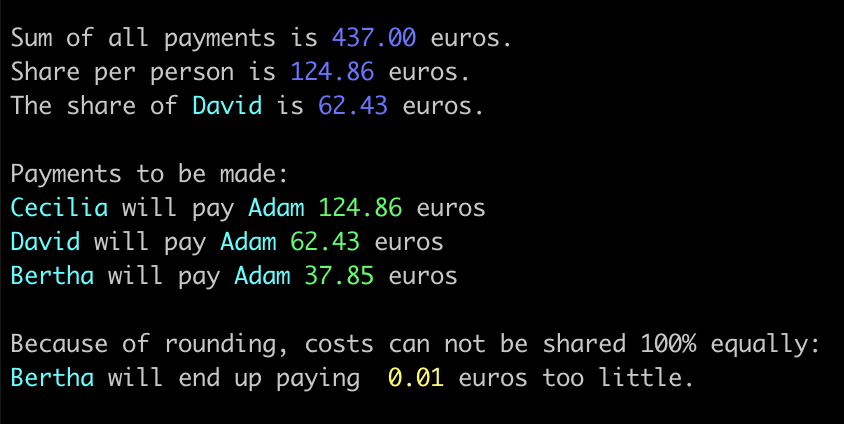
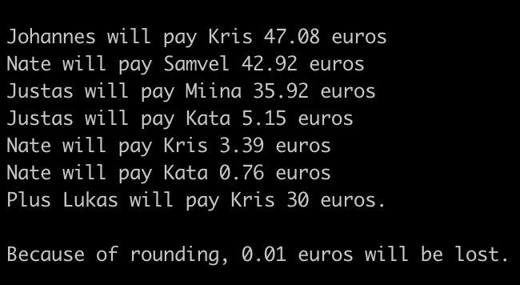

# Almost WeShare
## My own modified version of a cost-sharing program
I was at a cabin with my friends for Midsummer and by the end of the weekend, we each had paid different amounts of money for food, drinks, napkins etc. meant for the whole group. Originally, we had thought about using a cost-sharing app, like WeShare, but finally decided against it, because one friend only stayed for an evening.  
I wrote a cost-sharing program suitable for our exact situation, and I wanted to do it in Python, because I'm still getting familiar with the language.

## *UPDATED VERSION* weshare_dynamic.py *AND WHAT CHANGED*
I continued working on this program and made a new version called *weshare_dynamic.py*, in which names of people and the money they contributed can be added dynamically as command line arguments. This program also has a '-p' (percentage) option which allows for one person to pay less than other people. The '-p' argument is directly followed by a percentage which determines that person's share compared to other participants.  
  *weshare_dynamic.py* differs from my original *weshare.py*
(which I designed for a particular situation) also in other ways.
  I wanted to experiment with the Python Decimal library
because I was a bit concerned about the potential floating point inaccuracy. However, because I will have to round the shares of people to a cent (0.01 euros) there will almost always be a slight inconsistency with money in / money out, and someone might end up paying a couple cents less than other people, information which will also be printed out in the end.  
I also added error checks, 'usage' instructions and clear, colored printing of the results.

### How weshare_dynamic.py works
The program takes the names and contributions of people as command line arguments. If no arguments are given, the following 'usage' instructions are printed:    
```
Usage: python3 weshare_dynamic.py person_1 [contribution in euros] person_2 ...  -p x% 
person_who_pays_less [contribution in euros]  

Detailed instructions: Write name of person followed by the amount that person contributed to the 
overall cost of the shared event. If a person made multiple payments, those can be  added as separate
arguments. People who did not contribute to the costs must  have the number 0 as their payment.  

Option '-p' precedes the info of the person who is seen to have to  contribute less than other people.
'-p' option is followed by the percentage  of what that person has to pay compared to the other people. 
This is followed by  the name of the person and the amount they contributed.  

Example usage:  
python3 weshare_dynamic.py Adam 350 Bertha 10 30 47 Cecilia 0 -p 50% David 0  
```

First, the arguments are checked to see if the '-p' option was used, and if it was, the name and share percentage is saved into a list. Then, each argument is checked more closely in order to save the names of people and the amounts they contributed as key-value pairs into a 'payments' dictionary.  
   
At this point, weshare_dynamic.py starts to resemble my original weshare.py program more closely, except that when determining the 'share_per_person', one person will have a smaller share to pay, if the '-p' option was triggered.
  
Example output:  


  
## My original weshare.py program
### How the program works
Because I was writing a program for our specific situation, this program does not take arguments, it works as is. All participants 
(except for Lukas, who we decided would pay 30 euros) and their contributions are saved in a dict called 'payments'. After subtracting
 Lukas' 30 euros, the sum is divided in 7 to get the general amount each of the 7 participants must pay (in our case, a little over 
 47 euros). The 'payments' dict is updated subtracting the general amount from each persons contributions.  
   After, in a larger while loop, the dict is sorted into two lists of tuples, one in ascending order by contributions and one in reverse.
 In the loop, the person who is the most in debt will pay the person who made the biggest contribution and so on. The transactions are
 saved in a little list \[who gets paid, who pays, how much\] which is then added to 'completed', a list of lists. People, who have
 gotten to zero after a payment, are removed from the 'payments' dictionary. The loop will repeat until there are either no, or just one, person left in the 'payments' dictionary. When the program reaches its end, it prints the 'completed' list out in the form of
 who pays who and how much. If there is one person left in the 'payments' dict, (which can happen if we have an uneven number of 
 participants), the program states finally the amount of money that is 'lost' due to rounding etc.
   
   Final output  
 

 ### Things I learned
 I'm glad I wrote this program in Python, partly because I'm still trying to learn the language, and partly because I felt that it
 would fit this kind of problem well. I ended up using a lot of time understanding the data structures and how they might change. For
 example, it took me a while to understand that a sorted dict is actually a list of tuples, and because of that, the points of data are
 immutable. That's why I ended up updating the contributions of each person directly to the 'payments' dictionary, and not to the
 sorted lists.
 
